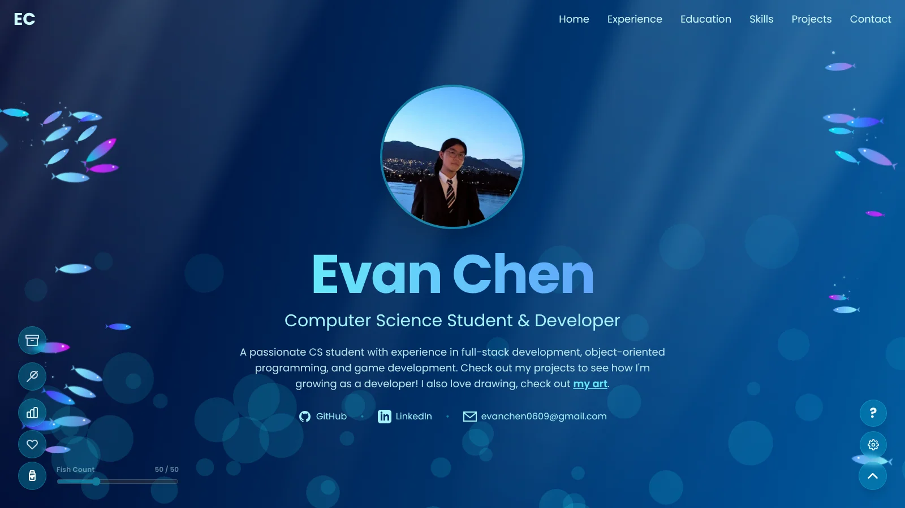
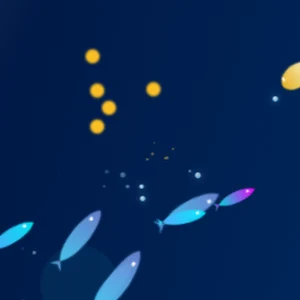
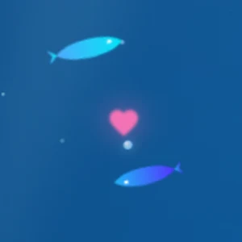
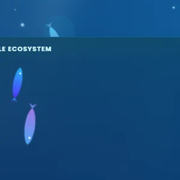
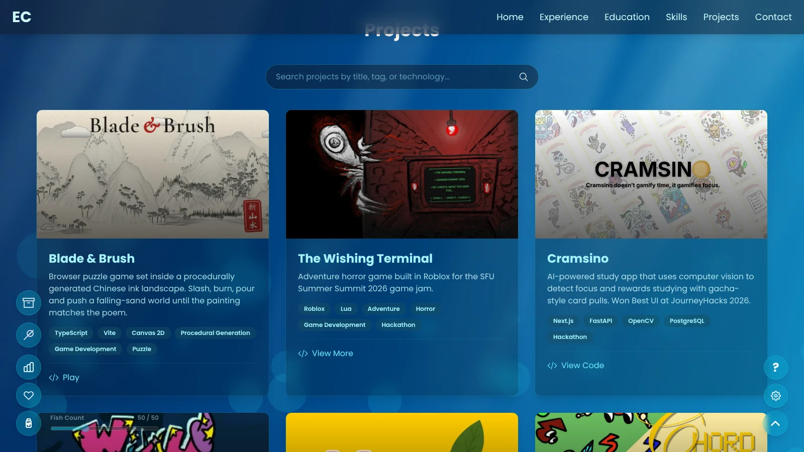

<p align="center">
  
</p>

<h1 align="center">Evan Chen</h1>

<p align="center"><b>A portfolio that lives underwater.</b></p>

<p align="center"><a href="https://evanchen.info"><b>Dive in</b></a> · <a href="https://evanchen.info/#projects">Projects</a> · <a href="https://github.com/evandongchen">GitHub</a> · <a href="https://www.linkedin.com/in/evandongchen/">LinkedIn</a></p>



## About

This is my portfolio, and it's also an aquarium. Light falls through the water, bubbles drift up past the text, and schools of fish swim behind everything you read.

The fish are alive. Each one has a mood: some cruise with their school, some dart off on their own, some loiter, some line up behind a leader in a conga line, and some get curious and come over to see what you're doing. Move your cursor too close and they scatter. Drop food and they race for it. Drop a heart and two of them will swim to it, dance, and leave a baby behind.

Somewhere between the fish are my projects, my experience and the things I've built.

## How to play

<p align="center">
  
  
  
</p>

The buttons on the left side of the screen are your tools:

| | Tool | What it does |
|---|---|---|
| 🍤 | **Fish food** | Drop food into the water. Nearby fish swim over and eat it. |
| 💗 | **Love mode** | Drop heart bait. Two fish meet at it, dance in a spiral and make a baby. |
| 🪝 | **Grab** | Pick up a fish and carry it anywhere on the page. |
| 🫙 | **Portable tank** | Keep the fish you've caught, breed them, and drag them back out. |
| 📊 | **Fish census** | Count the fish by behavior. Click a behavior to light up every fish doing it. |

**New here?** Press the **?** button in the corner for a tour of every tool.

## The catch

| Project | What it is |
|---|---|
| [**Blade & Brush**](https://evandongchen.github.io/BladeAndBrush/) | A puzzle game inside a Chinese ink landscape painting. Slash, burn, pour and push until the painting matches the poem. |
| [**The Wishing Terminal**](https://matchabatcha.itch.io/thewishingterminal) | An adventure horror game built in Roblox for the SFU Summer Summit 2026 game jam. |
| [**Cramsino**](https://devpost.com/software/cramsino) | An AI study app that watches your focus and pays you in gacha card pulls. Best UI at JourneyHacks 2026. |
| [**WitchDog**](https://devpost.com/software/witch-dog) | A real-time multiplayer trivia game in Unity, networked with Socket.IO. |
| [**Money Mango**](https://github.com/EvanDongChen/MoneyMango) | An Android finance app that reads your receipts with OCR. |
| [**Chord Breakers**](https://angrycow05.itch.io/chord-breaker) | A 2D action game with elemental combat and enemies driven by finite state machines. |

The rest are [on the site](https://evanchen.info/#projects), where you can search them by title, tag or technology.



## How it works

- **A simulation behind the page.** Every fish carries its own position, velocity, school and behavior, and an animation loop steers them each frame: schooling, fleeing the cursor, chasing food, following a conga leader, or spiralling with a partner.
- **Fish with variants and life stages.** Clownfish, puffers that puff up when you click them, and rare rainbow fish swim among the rest. Babies are born small and grow up.
- **Particles on canvas.** Bubbles, trails and click ripples are drawn on a canvas layer instead of as DOM elements, so the water stays busy without slowing the page.
- **It adapts to your device.** The site measures how smoothly it's running and scales back the fish count and effects to keep up, and the ⚙️ panel lets you pick the frame rate yourself.

Built with React, TypeScript, Vite and Tailwind CSS.

## Running it locally

```sh
npm install
npm run dev     # then open http://localhost:3000/
npm run build
```

Pushing to the `update` branch deploys the site to [evanchen.info](https://evanchen.info) with GitHub Actions.
